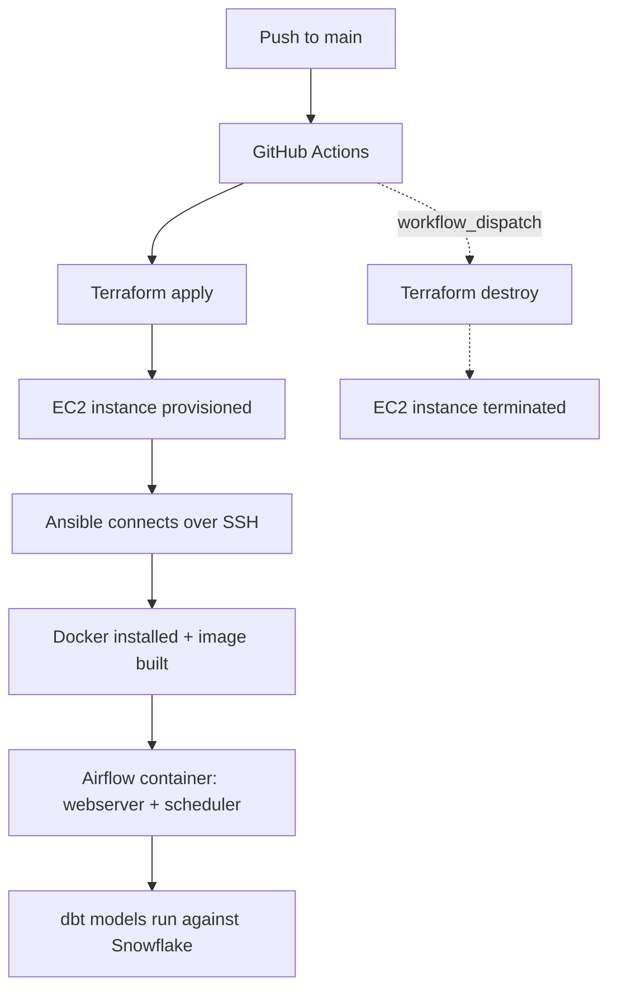

# Japan Visa Data Pipeline — Airflow + dbt on AWS

A self-provisioning data platform: push to `main`, and a fully configured Airflow + dbt
environment spins up on AWS, orchestrating a Snowflake pipeline for Japan visa data —
no manual server setup, no manual SSH, no manual anything.

This repo is the **infrastructure and orchestration layer**. DAGs and dbt models live in
a companion repo: [`airflow-dbt-snowflake-japan-visa`](https://github.com/NestDataOps/airflow-dbt-snowflake-japan-visa),
which gets cloned onto the instance at deploy time.

## Architecture



**The chain, in short:** Terraform only knows AWS — it provisions the EC2 instance and
security group, then hands off. SSH is the transport underneath everything that follows.
Ansible rides that SSH connection to install Docker and configure the box — it has no
agent, no daemon, just a series of commands pushed and reported back task-by-task.
Docker then owns the actual Airflow + dbt runtime, isolated from the host.

## Stack

| Layer | Tool | Role |
|---|---|---|
| CI/CD | GitHub Actions | Triggers deploy/destroy on push / manual dispatch |
| Infrastructure | Terraform | Provisions EC2, security group, key pair reference |
| Configuration | Ansible | Installs Docker, clones DAGs/dbt repo, deploys the container |
| Runtime | Docker | Packages Airflow + dbt into a single reproducible image |
| Orchestration | Apache Airflow 2.8.1 | Schedules and runs the pipeline |
| Transformation | dbt (dbt-core + dbt-snowflake) | Source freshness checks, tests, models |
| Warehouse | Snowflake | Destination for transformed data |
| Compute | AWS EC2 (t3a.medium) | Runs everything |

## Repository structure

```
.
├── terraform/
│   └── main.tf                  # EC2 instance, security group, variables
├── ansible/
│   ├── playbook_docker.yml      # Installs Docker, deploys the Airflow container
│   ├── ansible.cfg
│   └── files/docker/
│       ├── Dockerfile           # Airflow base image + dbt, two-stage pip install
│       ├── entrypoint.sh        # DB init (once) → scheduler (bg) → webserver (fg)
│       └── docker-compose.yml
└── .github/workflows/
    ├── deploy.yml                # terraform apply → wait for SSH → ansible-playbook
    └── destroy.yml                # terraform destroy
```

## How a deploy actually happens

1. **`deploy.yml`** triggers on push to `main` (path-filtered to `terraform/**`).
2. **Terraform** provisions the EC2 instance, using an SSH key pair passed in via
   GitHub secrets, and outputs the instance's public IP.
3. **GitHub Actions** polls port 22 until SSH is reachable, then hands off to Ansible.
4. **Ansible** installs Docker Engine, clones the DAGs/dbt repo onto the host, `chown`s
   it to the container's `airflow` UID (the repo is cloned as `root` on the host but
   consumed as a bind mount by an unprivileged container user — more on this below),
   writes a `.env` file containing Snowflake/AWS credentials (never committed to git),
   and runs `docker compose up -d --build`.
5. **Airflow** starts inside the container: one-time DB migration and connection setup
   on first boot, then scheduler and webserver run as sibling processes.
6. The Airflow UI is reachable at `http://<instance-ip>:8080` (`admin` / `admin`).

`destroy.yml` is a manually-triggered (`workflow_dispatch`) `terraform destroy` — this
project is meant to be spun up for a demo and torn back down, not run 24/7.

## Required GitHub secrets

| Secret | Used for |
|---|---|
| `AWS_ACCESS_KEY_ID` / `AWS_SECRET_ACCESS_KEY` | Terraform's AWS provider, and the Airflow `aws_default` connection |
| `SSH_PRIVATE_KEY` | Terraform's `private_key` variable, and Ansible's SSH connection to the instance |
| `EC2_KEY_NAME` | The AWS key pair name registered for the instance |
| `SNOWFLAKE_PASSWORD` | The Airflow `snowflake_default` connection, and dbt's `profiles.yml` (via `env_var()`) |

## Design decisions (and what actually went wrong along the way)

This project went through a few real architectural pivots — documenting them here
because the reasoning is more interesting than the final state alone.

**Terraform heredoc + bash variable interpolation.** Early on, `${AIRFLOW_VERSION}`
inside a Terraform `<<-EOF` heredoc was being interpreted as a Terraform resource
reference, not a bash variable — because Terraform interpolates *every* `${...}` inside
a heredoc, including ones meant for bash at runtime. Fixed by escaping bash-side
references as `$${...}`.

**`user_data` → Ansible.** The original provisioning ran entirely inside EC2
`user_data`, which offered no visibility into failures beyond a generic cloud-init
warning and a wall of log to reconstruct after the fact. Moved to Ansible so each
provisioning step reports pass/fail individually in the CI log, with the actual error
inline — no more SSHing in after a failure to guess what happened.

**Bare venv + systemd → Docker.** The original approach installed Airflow and dbt into
a shared Python virtualenv. Installing them in the *same* `pip install` command caused
a real dependency resolution conflict: Airflow's constraints file pins exact versions of
shared dependencies (`click`, `jinja2`, `pydantic`, etc.), and dbt's resolver, forced to
satisfy those same pins, backed off to a dbt-core version from 2019 with its own
conflicting sub-dependencies. Splitting into two separate `pip install` steps fixed
resolution — but the more durable fix was containerizing entirely: the Dockerfile builds
this two-stage install once, tested before it ever reaches the instance, rather than
hoping the resolution works out live in CI on every deploy.

**Bind-mount permissions.** The DAGs/dbt repo is cloned on the host as `root` (Ansible
runs privilege-escalated), then bind-mounted into the container where Airflow runs as an
unprivileged `airflow` user (UID 50000). Without an explicit `chown`, dbt would try to
write its `logs/`/`target/` directories into a read-only-to-it directory and fail
**silently** — no traceback, nothing printed, just an instant dead process. This is a
classic container/bind-mount ownership mismatch, fixed with an explicit `chown -R
50000:0` after cloning.

**Sizing:** started on `t3a.small` (2GB RAM), which handled a single lightweight
container but left ~zero headroom once `dbt` ran alongside Airflow's webserver +
scheduler — no swap configured meant memory pressure risked an OOM-kill rather than
graceful degradation. Settled on `t3a.medium` (4GB) given this environment runs
spin-up/spin-down for demos rather than continuously, making the modest added cost
easy to justify for headroom + reliability.

## Local development

To test the Docker image without touching AWS:

```bash
cd ansible/files/docker
git clone https://github.com/NestDataOps/airflow-dbt-snowflake-japan-visa.git repo
# create airflow.env with the same keys the Ansible playbook writes (see playbook_docker.yml)
docker compose up --build
# → http://localhost:8080
```

`repo/` and `airflow.env` are git-ignored — they contain a cloned repo and real
credentials respectively and should never be committed.

## Possible next steps

- Swap SQLite for Postgres + separate webserver/scheduler containers for genuine task
  concurrency (prototyped, reverted for simplicity/deploy speed — worth revisiting if
  this evolves past demo use).
- Terraform `plan` on pull requests, `apply` only on merge to `main`.
- CloudWatch or a lightweight healthcheck endpoint instead of manual `docker logs`.
